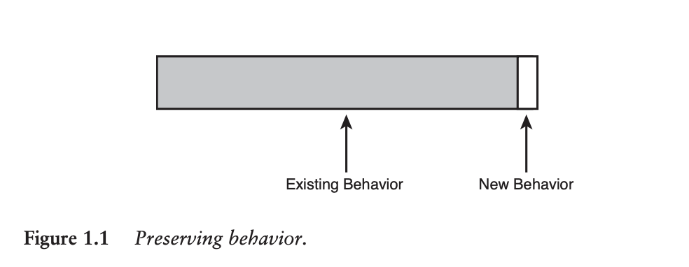

# Part 1 - The Mechanics of Change
## Chapter 1 - Changing Software
> For simplicity’s sake, let’s look at four primary reasons to change software.
> 1. Adding a feature
> 2. Fixing a bug
> 3. Improving the design
> 4. Optimizing resource usage

> Behavior is the most important thing about software. It is what users depend on. Users like it when we add behavior (provided it is what they really wanted), but if we change or remove behavior they depend on (introduce bugs), they stop trusting us.

> Feature addition and bug fixing are very much like refactoring and optimization. In all four cases, we want to change some functionality, some behavior, but we want to preserve much more (see Figure 1.1).



Any sort of change risks a change in behavior.

One way to mitigate this risk is, to write tests first, to verify existing behavior. This helps us ensure that existing behavior stays intact.

## Chapter 2 - Working with Feedback
Unit tests are critical to give us fast feedback while writing code. i.e. we can make a code change, then immediately run unit tests, to see if we broke anything.

> Here are qualities of good unit tests:
> 1. They run fast.
> 2. They help us localize problems.

> A unit test that takes 1/10th of a second to run is a slow unit test.

> When you have to make a change in a legacy code base, here is an algorithm you can use.
> 1. Identify change points.
> 2. Find test points.
> 3. Break dependencies.
> 4. Write tests.
> 5. Make changes and refactor.

## Chapter 3 - Sensing and Separation
Suppose you are testing an impure module. 

There are two potential testing pain points here:
1. **Sensing**
    - Difficulty asserting that a side effect was triggered
2. **Separation**
    - Difficulty running the module inside of a test context (since the module depends on global state)

One major technique to tackle "Sensing"

### Faking Collaborators
The main idea here is to:
1. Identify which part of the code is triggering side effects
2. Extract this "side effecting" code into its own module
    - This establishes clearer code boundaries
    - It also allows us to "mock out" the side effects
        - i.e. in a unit test, we don't trigger any side effects, but can still assert that the correct API was invoked, to trigger the side effects

#### Example:
Suppose we have a point-of-sale system as follows:
```typescript
class Sale {
    scan(barcode: string) {
        // Look up the name and price for the item
        // SIDE EFFECT - display the name/price on the cash register
    }
}
```

In this case, the side-effecting code is the "display" piece.

We can extract this into its own module, i.e. something like:
```typescript
interface Display {
    showLine(line: string): void;
}

class Sale {
    constructor(display: Display) {}

    scan(barcode: string) {
        // Look up the name and price for the item
        // SIDE EFFECT - display the name/price on the cash register
        this.display.showLine(name + price);
    }
}
```

The book then suggests creating two implementations of the `Display` interface, i.e. something like:
```typescript
// Real display, which actually triggers side effects
class ArtR56Display implements Display {}

// Mock, don't trigger side effects, but still assert against the mock
class FakeDisplay implements Display {
    override showLine(line: string): void {}

    // additional test helper methods/properties
    lastLine: string;
    getLastLine(): string
}
```

## Chapter 4 - The Seam Model
In Chapter 3, we discussed extracting out side-effecting code so that it's easier to mock.

But what if it's impractical to refactor like this?

i.e. maybe the legacy code in question is particularly nasty - so we decide to focus solely on adding test coverage, without refactoring any source code.

This is where **seams** can be useful.

> A **seam** is a place where you can alter behavior in your program without editing in that place.

> Every seam has an **enabling point**, a place where you can make the decision to use one behavior or another.

### Example:
```typescript
interface Cell {
    recalculate(): void;
}

buildSpreadsheet(cell: Cell) {
    cell.recalculate();
}
```

Here, the **enabling point** is the argument list to `buildSpreadsheet` - i.e. without making any code changes, we can pass in a "mock" `Cell` within a test.

The example below has neither a seam nor an enablement point.
```typescript
class FormulaCell implements Cell {}

buildSpreadsheet() {
    const cell = new FormulaCell();
    cell.recalculate();
}
```
