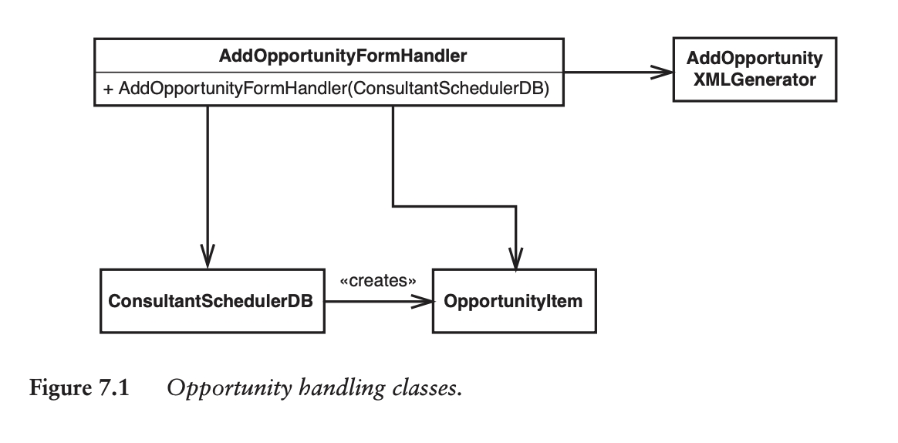
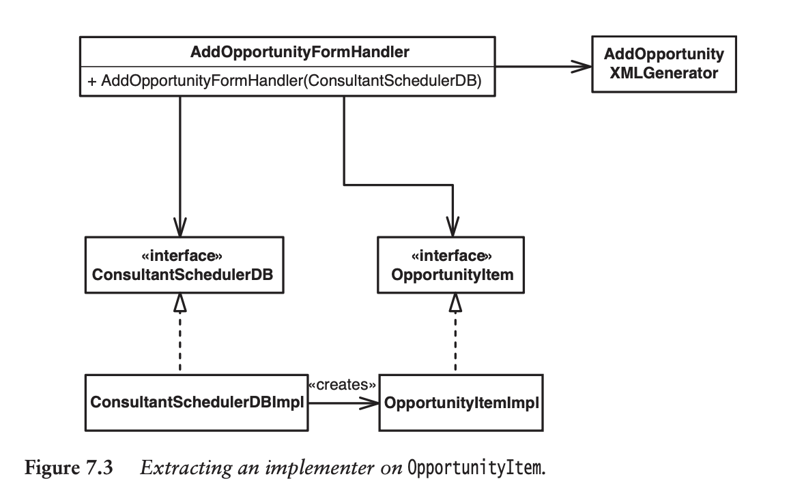
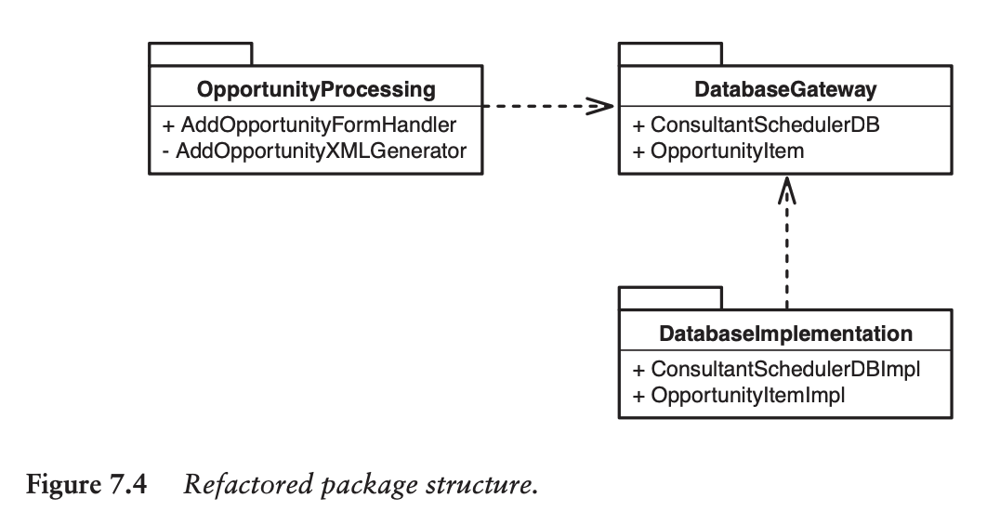

# Part 2 - Changing Software
## Chapter 6 - I Don’t Have Much Time and I Have to Change It
Writing tests takes extra time, but in the long-run will end up saving time.

> When I work with teams, I often start by asking them to take part in an experiment. For an iteration, we try to make no change to the code without having tests that cover the change. If anyone thinks that they can’t write a test, they have to call a quick meeting in which they ask the group whether it is possible to write the test.

Suppose:
- You're adding net-new functionality to existing code
- The existing code is untested

Ideally, we would take the time to add tests for the old code.

However, if doing so is hard, and we have a time constraint, then we could add tests only for the new code, leaving the old code untested for now.

Here are some strategies to do this.

First, let's look at an example. Suppose we have an `Employee` class that pays employees. We want to add new functionality, to log payments.

```typescript
class Employee {
    pay(): void {
        let amount = 0;
        for (const timecard of this.timecards) {
            amount += (timecard.hours * this.payRate);
        }
        this.payDispatcher.pay(this, amount);
    }
}
```

### Sprout Method
Insert a **net-new** function. The old code invokes the new function.

The new function gets tests, but the old code/call-site does not.

```typescript
class Employee {
    // NET-NEW! Has new unit tests!
    logPayment(amount: number): void {}

    pay(): void {
        let amount = 0;
        for (const timecard of this.timecards) {
            amount += (timecard.hours * this.payRate);
        }
        this.payDispatcher.pay(this, amount);

        // NET-NEW!
        logPayment(amount);
    }
}
```

### Sprout Class
Same as sprout method, except you extract the net-new functionality into a new class instead of method.

Two reasons to use Sprout Class:
- New functionality **should** be extracted in a separate class
- It's too difficult to get the existing class into a test harness

```typescript
// NET-NEW! Has new unit tests!
class Logger {
    constructor(private employee: Employee) {}
    logPayment(amount: number) {}
}

class Employee {
    pay(): void {
        let amount = 0;
        for (const timecard of this.timecards) {
            amount += (timecard.hours * this.payRate);
        }
        this.payDispatcher.pay(this, amount);

        // NET-NEW!
        const logger = new Logger(this);
        logger.logPayment(amount);
    }
}
```

### Wrap Method
The idea here is to REPLACE the original method. See example:

```typescript
class Employee {
    pay(): void {
        // The original `pay` function was extracted into its own function!
        dispatchPayment();
        // Invoke the net-new code!
        logPayment();
    }

    dispatchPayment(): void {
        let amount = 0;
        for (const timecard of this.timecards) {
            amount += (timecard.hours * this.payRate);
        }
        this.payDispatcher.pay(this, amount);
    }

    // NET-NEW! Has new unit tests!
    logPayment(): void {}

}
```

This is essentially the same as the "Sprout Method" technique, except we perform the extra step of extracting the old code into its own function.

### Wrap Class
The idea here is to REPLACE the original class. See example:

```typescript
class Employee {
    pay(): void {
        let amount = 0;
        for (const timecard of this.timecards) {
            amount += (timecard.hours * this.payRate);
        }
        this.payDispatcher.pay(this, amount);
    }
}

// Throughout the codebase, replace any instance of `Employee` with `LoggingEmployee`
class LoggingEmployee extends Employee {
    constructor(private employee: Employee) {}

    // Preserve the same public-facing API as `Employee`
    pay(): void {
        // call the old code
        this.employee.pay();
        // call the net-new code
        this.logPayment();
    }

    // NET-NEW! Has unit tests!
    logPayment(): void {}
}
```

## Chapter 7 - It Takes Forever to Make a Change
Why does it take so long to make a change?

### Understanding
In large codebases, it takes a while to gain context, and understand the current system.

Some of this is unavoidable - the larger the codebase, the more context there is to gain.

> In a well-maintained system, it might take a while to figure out how to make a change, but once you do, the change is usually easy and you feel much more comfortable with the system. In a legacy system, it can take a long time to figure out what to do, and the change is difficult also.

SOLUTION:
> Systems that are broken up into small, well-named, understandable pieces enable faster work.

### Lag Time
> Lag time is the amount of time that passes between a change that you make and the moment that you get real feedback about the change.

One reason for large lag time - modules are all tightly coupled - i.e. the entire app MUST be compiled all together.

Ideally, we should be able to compile a single module in isolation. This allows rebuilds/tests to run much faster.

#### Breaking Dependencies
In this strategy, we establish abstract interfaces for our modules.

Then, we can implement "fake" modules inside of a test environment. This has the following advantages:
- Speeds up compile times for tests
- Makes code easier to change - we can swap out/edit the concrete implementations of these interfaces, as needed

##### Example
Suppose we have a software architecture like this:



The constructor for `AddOpportunityFormHandler` accepts two arguments: `ConsultantSchedulerDB` and `OpportunityItem`.

We can extract out an abstract interface for the two arguments:


We can further extract these out into packages:


> [!NOTE]
> This strategy increases *overall* compilation time, but decreases *local* compilation time.
